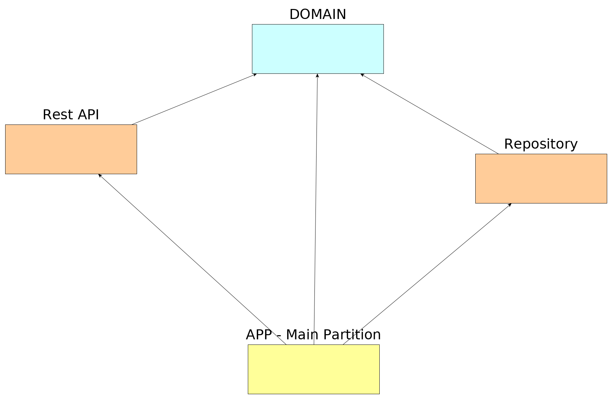

[](https://circleci.com/gh/lorenzomartino86/money-transfer-app)
[](https://codecov.io/gh/lorenzomartino86/money-transfer-app)
# Money Transfer App
A Java RESTful API to handle money transfers between different accounts.

### Architecture
This application has been splitted in following maven modules:

1. **money-transfer-domain:** Layer responsible of the business domain.
2. **money-transfer-repository:** Layer responsible of persist the relevant data. See the [repository documentation](money-transfer-repository/README.md).
3. **money-transfer-rest-api:** Layer responsible of exposing a lightweight Rest API. See the [rest api module documentation](money-transfer-rest-api/README.md)
4. **money-transfer-app:** Main partition and entrypoint to boot the application.

I was inspired by the Hexagonal architecture in order to build software components high cohesive and loosely coupled. 
The following diagram resumes the dependencies between the various layers and as you can see the domain layer doesn't depend on any other layer.


See the [domain documentation](money-transfer-domain/README.md) for more details on the domain module.

### Technical Background


### Build Instructions
```sh
mvn clean install
```

### Run Instructions
After build you can run the standalone executable jar located at *money-transfer-app/target*
```sh
java -jar money-transfer-app/target/money-transfer-app-1.0.0-SNAPSHOT.jar
```

### Demo
Make sure that the app is listening on localhost:8080 before starting. Check the [api documentation](money-transfer-rest-api/README.md) before starting with the demo.

**N.B**: This app is actually handling just the currencies: EUR, USD, GBP.

We are going to create the an account in currency *EUR* with name *Demo Account* and balance *100.0*:

    curl --header "Content-Type: application/json" --request POST --data '{"name":"Demo Account","balance":100.0,"currency": "EUR"}' http://localhost:8080/api/accounts
 
Here the response that we should see:

    {"id":"0129c523-c77a-4fb4-8e7f-ae614ca5a707","name":"Demo Account","balance":100.00,"createdAt":"2019-07-11T17:37:47","currency":"EUR"}
    
Now we need a second account with currency *GBP*, name *Other Currency Account* and balance *10.0*: 

    curl --header "Content-Type: application/json" --request POST --data '{"name":"Other Currency Account","balance":10.0,"currency": "GBP"}' http://localhost:8080/api/accounts
    
Here the response:

    {"id":"11d600f4-dbf1-4d39-a34e-d080adf851a5","name":"Other Currency Account","balance":10.00,"createdAt":"2019-07-11T17:40:44","currency":"GBP"}
    
At this point we can get the details by account id:

    curl --header "Content-Type: application/json" --request GET http://localhost:8080/api/accounts/0129c523-c77a-4fb4-8e7f-ae614ca5a707
    
And we should see again the json:

    {"id":"0129c523-c77a-4fb4-8e7f-ae614ca5a707","name":"Demo Account","balance":100.00,"createdAt":"2019-07-11T17:37:47","currency":"EUR"}
    
Now we can create the first money transfer of 5.0 EURO between account from accountId *0129c523-c77a-4fb4-8e7f-ae614ca5a707* to accountId *11d600f4-dbf1-4d39-a34e-d080adf851a5*:

    curl --header "Content-Type: application/json" --request POST \
         --data '{"fromAccountId":"0129c523-c77a-4fb4-8e7f-ae614ca5a707","toAccountId":"11d600f4-dbf1-4d39-a34e-d080adf851a5","amount": 5.0 , "currency": "EUR", "description": "Demo Transfer A"}' \
         http://localhost:8080/api/transfers
    
We should see the transfer created:

    {
        "id":"e7956d8e-ab50-4210-a2a0-35fc3812088a",
        "fromAccountId":"0129c523-c77a-4fb4-8e7f-ae614ca5a707",
        "toAccountId":"11d600f4-dbf1-4d39-a34e-d080adf851a5",
        "amount":5.00,
        "currency":"EUR",
        "description":"Demo Transfer A",
        "createdAt":"2019-07-11T17:45:35"
    }
    
We can make another transfer but this time from *11d600f4-dbf1-4d39-a34e-d080adf851a5* to *0129c523-c77a-4fb4-8e7f-ae614ca5a707*:

    curl --header "Content-Type: application/json" --request POST \
         --data '{"fromAccountId":"11d600f4-dbf1-4d39-a34e-d080adf851a5","toAccountId":"0129c523-c77a-4fb4-8e7f-ae614ca5a707","amount": 10.0 , "currency": "GBP", "description": "Demo Transfer B"}' \
         http://localhost:8080/api/transfers

So a new transfer is created:

    {
        "id":"abc0b2ef-e6a7-4d15-bac1-9268b4b1d637",
        "fromAccountId":"11d600f4-dbf1-4d39-a34e-d080adf851a5",
        "toAccountId":"0129c523-c77a-4fb4-8e7f-ae614ca5a707",
        "amount":10.00,
        "currency":"GBP",
        "description":"Demo Transfer B",
        "createdAt":"2019-07-11T17:48:09"
    }
    
We can inquiry the transfers of account *0129c523-c77a-4fb4-8e7f-ae614ca5a707*:

    curl -X GET http://localhost:8080/api/accounts/0129c523-c77a-4fb4-8e7f-ae614ca5a707/transfers

We can see following transactions for this account. Transaction can be WITHDRAW (outbound) or DEPOSIT (inbound).
All transactions are calculated with the account currency.

    [
        {
            "id":"e7956d8e-ab50-4210-a2a0-35fc3812088a",
            "type":"WITHDRAW",
            "amount":5.00,
            "currency":"EUR",
            "description":"Demo Transfer A",
            "createdAt":"2019-07-11T17:45:35"
        },
        {
            "id":"abc0b2ef-e6a7-4d15-bac1-9268b4b1d637",
            "type":"DEPOSIT",
            "amount":11.13,
            "currency":"EUR",
            "description":"Demo Transfer B",
            "createdAt":"2019-07-11T17:48:09"
        }
    ] 

We can check the final balance of this account

    curl --header "Content-Type: application/json" --request GET http://localhost:8080/api/accounts/0129c523-c77a-4fb4-8e7f-ae614ca5a707

Here the response:

    {
        "id":"0129c523-c77a-4fb4-8e7f-ae614ca5a707",
        "name":"Demo Account",
        "balance":106.13,
        "createdAt":"2019-07-11T17:37:47",
        "currency":"EUR"
    }

### Resources
- [SparkJava](http://sparkjava.com/)
- [ormlite](http://ormlite.com/)
- [Guice](https://github.com/google/guice)
- [Hexagonal Architecture](https://dzone.com/articles/writing-a-microservice-in-golang-which-communicate)