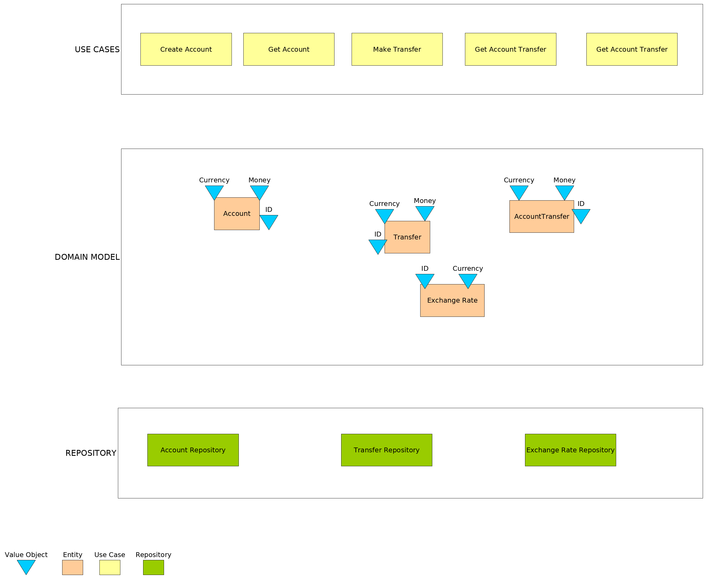

# Domain Module
This module has the responsibility to handle business logic of money transfers between accounts domain.

## Domain Model
Following diagram resumes the adopted domain model.

Model is mapped in three different groups:

1. **Use Cases**: Services classes responsible to carry on the business request.
2. **Domain Models**: Group of entities and value objects.
3. **Repositories**: The abstract repositories required by the business model.  
